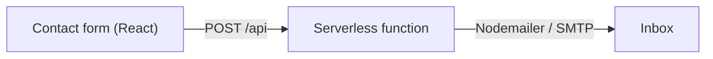

# Portfolio

Source for my personal site, [manankakkar.com](https://manankakkar.com). A
React single-page app built with Vite and TypeScript, plus a small serverless
function that delivers the contact form.

## Stack

- React 19, React Router, `react-transition-group` for page transitions
- Vite, TypeScript, Bootstrap 5
- Vercel Analytics
- Contact form: a Vercel serverless function (`api/index.js`) that sends mail
  with Nodemailer; `contact-backend/` is the same handler as a standalone
  Express server for local use

## How the contact form works



## Develop

```bash
npm install
npm run dev        # Vite dev server
npm run build      # tsc -b && vite build
npm run preview    # serve the production build
```

The frontend expects the contact endpoint at `/api`. To run it locally instead
of on Vercel, start the standalone server:

```bash
cd contact-backend
npm install
# set SMTP credentials in the environment, then:
node index.js
```

## Layout

```
src/            React app (pages, components, assets)
api/index.js    Vercel serverless contact handler
contact-backend/  same handler as a local Express server
public/         static assets
```
